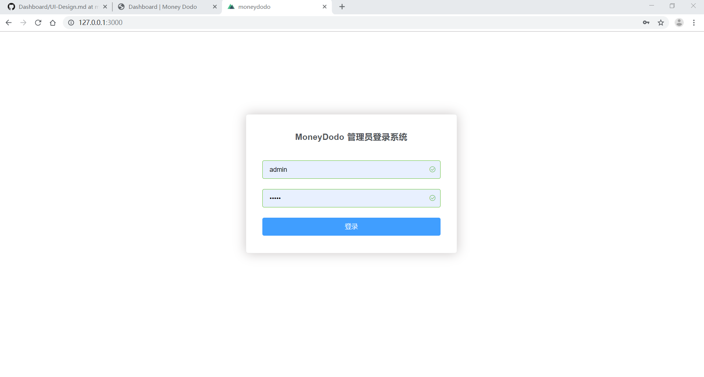
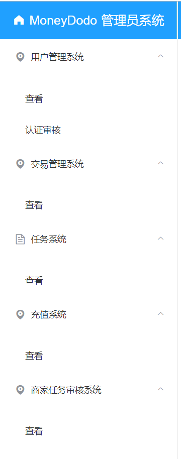
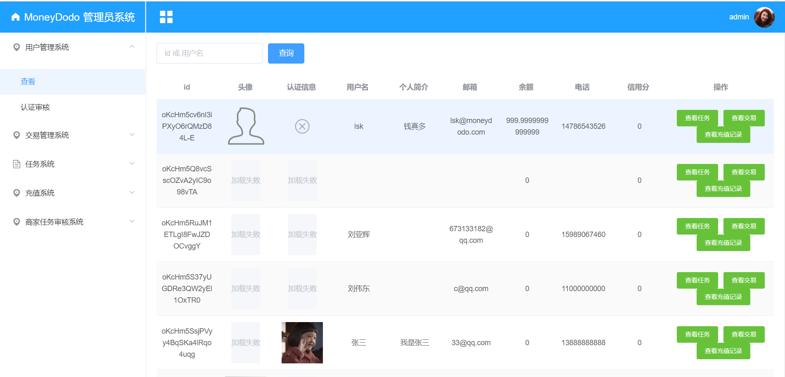
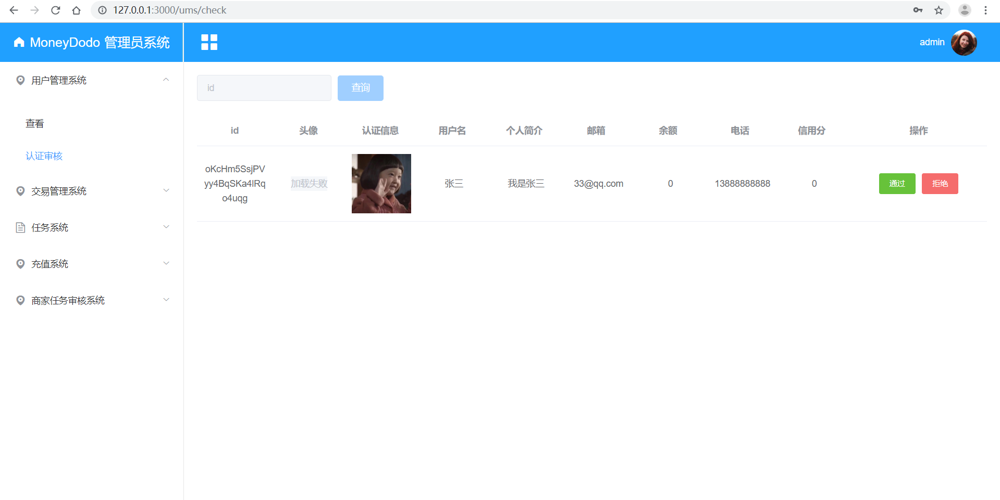
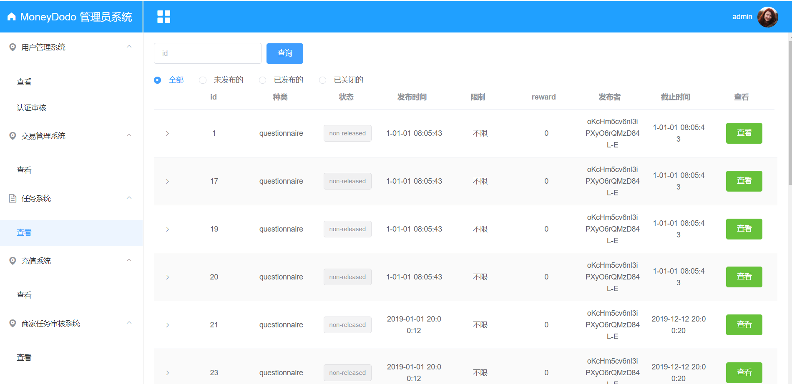
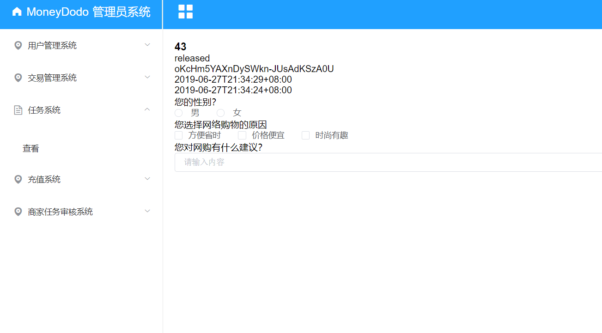
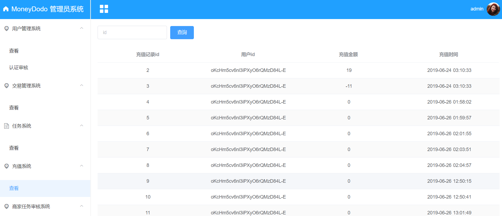
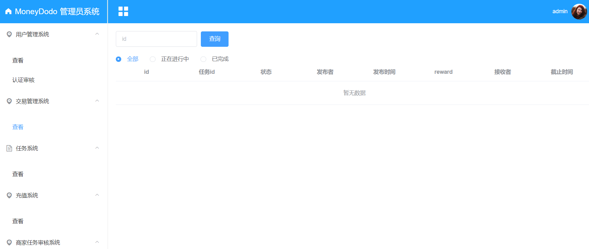
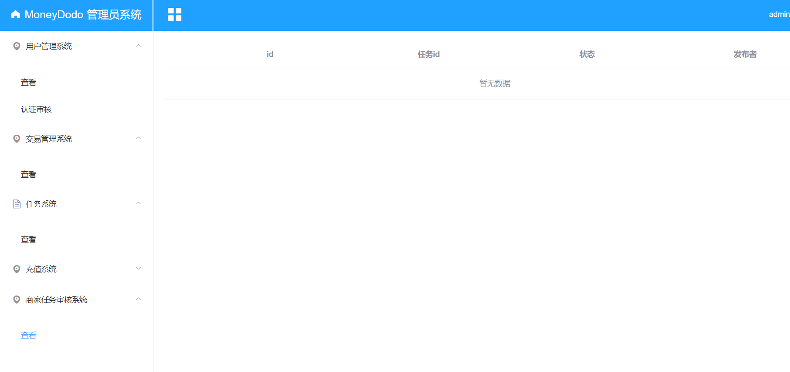
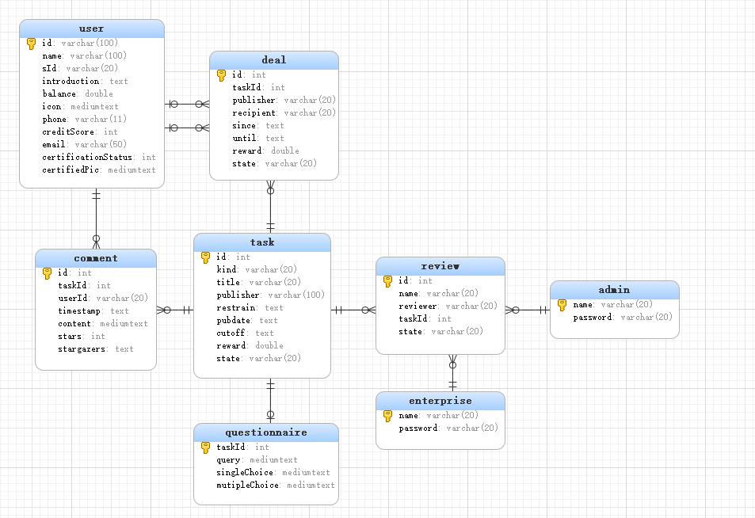

# 设计说明书

## 一、界面设计

### 小程序端

|                                                              |                                                              |
| ------------------------------------------------------------ | ------------------------------------------------------------ |
| 查看个人信息/完善个人信息界面(未认证) | 查看个人信息/完善个人信息界面(已认证) |
| 首页 | 发布任务页 |
| 设计/填写问卷页 | 我的页面 |
| 成功提示页 | 任务详情页 |

### web端

1. 登录页面



2. 主页面左侧菜单



3. 查看注册用户



4. 用户认证审核



5. 查看任务



6. 查看任务详情



7. 查看充值记录



8. 查看所有的记录



9. 查看商家



## 二、数据库设计

### 1. 用户及权限系统数据库设计

#### ER 图

**学生：**


**管理员：**


**企业用户：**


**说明：**

系统主要面向两类用户，普通的高校学生和企业商家，分别由小程序端和商家端提供服务。目前没有权限系统的设计，两类角色对系统的对象和数据资源的控制，并不需要用不同的权限加以区分，被限制只能做安全操作。同时管理员具有整个系统的最高权限。

### 2.  交易子系统数据库设计

#### ER 图


**说明:**

交易子系统主要功能包括用户充值与提现、任务的支付与奖励获取。

### 3. 任务子系统数据库设计

#### ER图



## 三、API设计- RESTful

【注】API前标有*号的预打算删除。

【注】返回类型说明中Res{}，省略字段为通用字段，只有Data会有所变化。

### A. 用户相关

此系统主要用来处理用户的相关信息。

#### 1. 登陆服务（authentication）PORT=8001

**BASE_URL=http://localhost:8001/api/auth**

| 描述 | 方法 | API                                   | 参数   | 返回类型              |
| ---- | ---- | ------------------------------------- | ------ | --------------------- |
| 登陆 | POST | http://localhost:8001/api/auth/user   | {code} | Res{,,{openid,token}} |
|      | POST | http://localhost:8001/api/auth/admin  | Admin  | Res{,,nil}            |
|      | POST | http://localhost:8001/api/auth/firm   |        |                       |
| 退出 | GET  | http://localhost:8001/api/auth/logout | nil    | Res{,,nil}            |

#### 2. 实名认证（certify）PORT=8002

**用户API：**
**BASE_URL=http://localhost:8002/api/users/{userId}/certs**

| 描述                       | 方法 | API                                            | 参数 | 返回类型    |
| -------------------------- | ---- | ---------------------------------------------- | ---- | ----------- |
| 认证（成功之后不允许修改） | POST | http://localhost:8002/api/users/{userId}/certs | User | Res{,,User} |
|                            | GET  | http://locahost:8002/api/users/{userId}/certs  | nil  | Res{,,User} |

**管理员API：**
**BASE_URL=http://localhost:8002/api/certs**

| 描述                           | 方法 | API                                      | 参数 | 返回类型      |
| ------------------------------ | ---- | ---------------------------------------- | ---- | ------------- |
| 查看所有认证信息               | GET  | http://localhost:8002/api/certs          | nil  | Res{,,[]User} |
| 获取某个用户的认证信息         | GET  | http://localhost:8002/api/certs/{userId} | nil  | Res{,,User}   |
| 通过或者拒绝某个用户的认证信息 | POST | http://localhost:8002/api/certs/{userId} | User | Res{,,User}   |

#### 3. 个人信息（user）PORT=8003

**BASE_URL=http://localhost:8003/api/users**

**用户API：**

| 描述     | 方法   | API                                      | 参数 | 返回类型    |
| -------- | ------ | ---------------------------------------- | ---- | ----------- |
| 个人信息 | GET    | http://localhost:8003/api/users/{userId} | nil  | Res{,,User} |
|          | PUT    | http://localhost:8003/api/users/{userId} | User | Res{,,nil}  |
| 注销     | DELETE | http://localhost:8003/api/users/{userId} | nil  | Res{,,nil}  |

**管理员API：**

| 描述             | 方法   | API                                        | 参数 | 返回类型      |
| ---------------- | ------ | ------------------------------------------ | ---- | ------------- |
| 查询所有用户     | GET    | http://localhost:8003/api/users            | nil  | Res{,,[]User} |
| 查询某个用户     | GET    | http://localhost:8003/api/users/{userId}   | nil  | Res{,,User}   |
| 根据名称查询用户 | GET    | http://localhost:8003/api/users/{username} | nil  | Res{,,[]User} |
| *创建用户        | POST   | http://localhost:8003/api/users            | User | Res{,,[]User} |
| *删除用户        | DELETE | http://localhost:8003/api/users/{userId}   | nil  | Res{,,nil}    |

### B. 任务相关

此系统追踪任务的创建与发布，以及查询操作。（当查询所有任务时默认返回task简略信息，指明Id时返回详细信息）

#### 4. 用户任务信息（task）PORT=8004

**BASE_URL=http://localhost:8004/api/users/{userId}/tasks**

**用户API：**

| 描述                   | 方法 | API                                                          | 备注                    | 参数 | 返回类型      |
| ---------------------- | ---- | ------------------------------------------------------------ | ----------------------- | ---- | ------------- |
| 查询和自己创建的任务   | GET  | http://localhost:8004/api/users/{userId}/tasks               | userId为token中的userId | nil  | Res{,,[]Task} |
| 查询某个用户发布的任务 | GET  | http://localhost:8004/api/users/{userId}/tasks?state=released | 不需要认证              | nil  | Res{,,[]Task} |
| 查询自己未发布的任务   | GET  | http://localhost:8004/api/users/{userId}/tasks?state=non-released | userId为token中的userId | nil  | Res{,,[]Task} |
| 查询自己关闭的任务     | GET  | http://localhost:8004/api/users/{userId}/tasks?state=closed  | userId为token中的userId | nil  | Res{,,[]Task} |

**管理员API：**

| 描述                   | 方法 | API                                                          | 参数 | 返回类型      |
| ---------------------- | ---- | ------------------------------------------------------------ | ---- | ------------- |
| 查询用户发起的所有任务 | GET  | http://localhost:8004/api/users/{userId}/tasks               | nil  | Res{,,[]Task} |
| 查询用户关闭的任务     | GET  | http://localhost:8004/api/users/{userId}/tasks?state=closed  | nil  | Res{,,[]Task} |
| 查询用户发布的任务     | GET  | http://localhost:8004/api/users/{userId}/tasks?state=released | nil  | Res{,,[]Task} |
| 查询用户未发布的任务   | GET  | http://localhost:8004/api/users/{userId}/tasks?state=non-released | nil  | Res{,,[]Task} |

#### 5. 任务交互（cpt）PORT=8005

**BASE_URL=http://localhost:8005/api/tasks**

**用户API：**

| 描述             | 方法   | API                                                         | 备注                                     | 参数                           | 返回类型      |
| ---------------- | ------ | ----------------------------------------------------------- | ---------------------------------------- | ------------------------------ | ------------- |
| 查询所有任务     | GET    | http://localhost:8005/api/tasks                             | 不需要认证                               | nil                            | Res{,,[]Task} |
| 查询某个任务     | GET    | http://localhost:8005/api/tasks/{taskId}                    | 不需要认证，指明任务Id时返回具体任务详情 | nil                            | Res{,,Qtnr}   |
| 创建任务         | POST   | http://localhost:8005/api/tasks                             | 当前任务类型以问卷为主                   | Wrapper{"questionnaire", Qtnr} | Res{,,Qtnr}   |
| 修改任务         | PUT    | http://localhost:8005/api/tasks/{taskId}                    |                                          | Wrapper{"questionnaire", Qtnr} | Res{,,nil}    |
| 删除关闭的任务   | DELETE | http://localhost:8005/api/tasks/{taskId}?state=closed       |                                          | nil                            | Res{,,nil}    |
| 取消发布任务     | DELETE | http://localhost:8005/api/tasks/{taskId}?state=released     |                                          | nil                            | Res{,,nil}    |
| 删除未发布的任务 | DELETE | http://localhost:8005/api/tasks/{taskId}?state=non-released |                                          | nil                            | Res{,,nil}    |

**管理员API：**

| 描述             | 方法 | API                                                | 参数 | 返回类型      |
| ---------------- | ---- | -------------------------------------------------- | ---- | ------------- |
| 查询所有任务     | GET  | http://localhost:8005/api/tasks                    | nil  | Res{,,[]Task} |
| 查询某个任务     | GET  | http://localhost:8005/api/tasks/{taskId}           | nil  | Res{,,Qtnr}   |
| 查询未发布的任务 | GET  | http://localhost:8005/api/tasks?state=non-released | nil  | Res{,,[]Task} |
| 查询发布的任务   | GET  | http://localhost:8005/api/tasks?state=released     | nil  | Res{,,[]Task} |
| 查询关闭的任务   | GET  | http://localhost:8005/api/tasks?state=closed       | nil  | Res{,,[]Task} |

#### 6. 任务评论（comment）PORT=8006

**BASE_URL=http://localhost:8006/api/tasks/{taskId}/comments**

**用户API：**

| 描述               | 方法   | API                                                          | 参数    | 返回类型         |
| ------------------ | ------ | ------------------------------------------------------------ | ------- | ---------------- |
| 获取某个task的评论 | GET    | http://localhost:8006/api/tasks/{taskId}/comments            | nil     | Res{,,[]Comment} |
| 发表评论           | POST   | http://localhost:8006/api/tasks/{taskId}/comments            | Comment | Res{,,Comment}   |
| 更改某条评论       | PUT    | http://localhost:8006/api/tasks/{taskId}/comments/{cid}      | Comment | Res{,,Comment}   |
| 删除某条评论       | DELETE | http://localhost:8006/api/tasks/{taskId}/comments/{cid}      | nil     | Res{,,nil}       |
| 点赞某条评论       | PUT    | http://localhost:8006/api/tasks/{taskId}/comments/{cid}/star | nil     | Res{,,nil}       |
| 取消点赞某条评论   | DELETE | http://localhost:8006/api/tasks/{taskId}/comments/{cid}/star | nil     | Res{,,nil}       |

**管理员API：**

| 描述             | 方法   | API                                                     | 参数 | 返回类型         |
| ---------------- | ------ | ------------------------------------------------------- | ---- | ---------------- |
| 查看某个task评论 | GET    | http://localhost:8006/api/tasks/{taskId}/comments       | nil  | Res{,,[]Comment} |
| 删除某条评论     | DELETE | http://localhost:8006/api/tasks/{taskId}/comments/{cid} | nil  | Res{,,nil}       |

### C. 交易系统

此系统追踪发布者接受者双方任务的进行。

#### 7. 用户交易（deal）PORT=8007

**查询用户相关交易：BASE_URL=http://localhost:8007/api/users/{userId}/deals**
**操作相关交易：BASE_URL=http://localhost:8007/api/deals**

**用户API：**

| 描述                       | 方法   | API                                            | 参数 | 返回类型      |
| -------------------------- | ------ | ---------------------------------------------- | ---- | ------------- |
| 查看用户参与的所有交易     | GET    | http://localhost:8007/api/deals                | nil  | Res{,,[]Deal} |
| 查看用户进行中的交易       | GET    | http://localhost:8007/api/deals?state=underway | nil  | Res{,,[]Deal} |
| 查看用户结束的交易         | GET    | http://localhost:8007/api/deals?state=closure  | nil  | Res{,,[]Deal} |
| 查看用户某笔交易           | GET    | http://localhost:8007/api/deals/{dId}          | nil  | Res{,,Deal}   |
| 删除结束的交易             | DELETE | http://localhost:8007/api/deals/{dId}          | nil  | nil           |
| 创建交易（接受任务）       | POST   | http://localhost:8007/api/deals                | Deal | Res{,,Deal}   |
| 双方确认交易完成并进行转账 | PUT    | http://localhost:8007/api/deals/{did}          | Deal | Res{,,Deal}   |

**管理员API：**

| 描述                   | 方法 | API                                                          | 参数 | 返回类型      |
| ---------------------- | ---- | ------------------------------------------------------------ | ---- | ------------- |
| 查看用户参与的所有交易 | GET  | http://localhost:8007/api/users/{userId}/deals               | nil  | Res{,,[]Deal} |
| 查看用户进行中的交易   | GET  | http://localhost:8007/api/users/{userId}/deals?state=underway | nil  | Res{,,[]Deal} |
| 查看用户结束的交易     | GET  | http://localhost:8007/api/users/{userId}/deals?state=closure | nil  | Res{,,[]Deal} |
| 查看所有交易           | GET  | http://localhost:8007/api/deals                              | nil  | Res{,,[]Deal} |
| 查看某笔交易           | GET  | http://localhost:8007/api/deals/{dId}                        | nil  | Res{,,[]Deal} |
| 查看所有尚未完成的交易 | GET  | http://localhost:8007/api/deals?state=underway               | nil  | Res{,,[]Deal} |
| 查看所有结束的交易     | GET  | http://localhost:8007/api/deals?state=closure                | nil  | Res{,,[]Deal} |

### D. 充值系统

此系统用于追踪用户充值操作以及查询余额信息等操作。

#### 8. 充值信息（charge）PORT=8008

**查询用户充值信息：BASE_URL=http://localhost:8008/api/users/{userId}/charges**
**充值操作：BASE_URL=http://localhost:8008/api/charges**

**用户API：**

| 描述             | 方法   | API                                     | 参数   | 返回类型        |
| ---------------- | ------ | --------------------------------------- | ------ | --------------- |
| 查看用户充值信息 | GET    | http://localhost:8008/api/charges       | nil    | Res{,,[]Charge} |
| 账户充值         | POST   | http://localhost:8008/api/charges       | Charge | Res{,,Charge}   |
| 查询某个充值记录 | GET    | http://localhost:8008/api/charges/{cid} | nil    | Res{,,Charge}   |
| 删除充值信息     | DELETE | http://localhost:8008/api/charges/{cid} | nil    | Res{,,nil}      |

**管理员API：**

| 描述             | 方法 | API                                              | 参数 | 返回类型        |
| ---------------- | ---- | ------------------------------------------------ | ---- | --------------- |
| 查看用户充值信息 | GET  | http://localhost:8008/api/users/{userId}/charges | nil  | Res{,,[]Charge} |
| 查询所有充值记录 | GET  | http://localhost:8008/api/charges                | nil  | Res{,,[]Charge} |
| 查询某个充值记录 | GET  | http://localhost:8008/api/charges/{cid}          | nil  | Res{,,Charge}   |

### E. 商家任务审核系统（review）PORT=8009

商家提交任务，经过系统审核方可放置到平台上。

**审核操作：BASE_URL=http://localhost:8009/api/reviews**

**商家API：**

| 描述                 | 方法 | API                                     | 参数   | 返回类型        |
| -------------------- | ---- | --------------------------------------- | ------ | --------------- |
| 提交审核             | POST | http://localhost:8009/api/reviews       | Review | Res{,,Review}   |
| 查看审核结果         | GET  | http://localhost:8009/api/reviews/{rid} | nil    | Res{,,Review}   |
| 查询当前商家所有审核 | GET  | http://localhost:8009/api/reviews       | nil    | Res{,,[]Review} |

**管理员API：**

| 描述         | 方法 | API                                     | 参数   | 返回类型        |
| ------------ | ---- | --------------------------------------- | ------ | --------------- |
| 修改审核状态 | PUT  | http://localhost:8009/api/reviews/{rid} | Review | Res{,,Review}   |
| 查询所有审核 | GET  | http://localhost:8009/api/reviews       | nil    | Res{,,[]Review} |

### Z. Model 数据结构说明

**Admin属性表：**

```go
type Admin struct {
    Name     string `json:"name"`
    Password string `json:"password"`
}
```

**User属性表：**

```go
type User struct {
    Id                  string  `json:"id"`
    SId                 string  `json:"sId" xorm:"sId"`
    Name                string  `json:"name"`
    Introduction        string  `json:"introduction"`
    Balance             float64 `json:"balance"`
    Icon                string  `json:"icon"`
    Phone               string  `json:"phone"`
    CreditScore         int     `json:"creditScore" xorm:"creditScore"`
    Email               string  `json:"email"`
    CertifiedPic        string  `json:"certifiedPic" xorm:"certifiedPic"`
    CertificationStatus int     `json:"certificationStatus" xorm:"certificationStatus"`
}
```

**Task元数据属性表：**

```go
// task状态、类型约定属性
const (
    TaskStateNonReleased  = "non-released"
    TaskStateReleased     = "released"
    TaskStateClosed       = "closed"
    TaskKindQuestionnaire = "questionnaire"
)

type Task struct {
    Id        string    `json:"id" xorm:"<-"`
    Kind      string    `json:"kind"`
    Title     string    `json:"title"`
    Publisher string    `json:"publisher"`
    Restrain  string    `json:"restrain"`
    Pubdate   time.Time `json:"pubdate"`
    Cutoff    time.Time `json:"cutoff"`
    Reward    float64   `json:"reward"`
    State     string    `json:"state"`
}
```

**Questionnaire属性表：**

```go
type Qtnr struct {
    Task
    Qtnr *Questionnaire `json:"qtnr"`
}

type Questionnaire struct {
    TaskId        string          `json:"taskId" xorm:"taskId"`
    Query         []query         `json:"query" xorm:"query"`
    SingleChoice  []singleChoice  `json:"singleChoice" xorm:"singleChoice"`
    MutipleChoice []mutipleChoice `json:"mutipleChoice" xorm:"mutipleChoice"`
}

type query struct {
    Question string `json:"question"`
    Answer   string `json:"answer"`
}

type singleChoice struct {
    Question string   `json:"question"`
    Choices  []string `json:"choices"`
    Answer   string   `json:"answer"`
}

type mutipleChoice struct {
    Question string   `json:"question"`
    Choices  []string `json:"choices"`
    Answers  []string `json:"answers"`
}
```

**Deal属性表：**

```go
// deal状态约定属性
const (
	DealStateUnderway = "underway"
	DealStateRecConfirm = "recConfirm"
    DealStatePubConfirm = "pubConfirm"
)

type Deal struct {
    Id        string    `json:"id" xorm:"<-"`
    TaskId    string    `json:"taskId" xorm:"taskId"`
    Publisher string    `json:"publisher" xorm:"publisher"`
    Recipient string    `json:"recipient" xorm:"recipient"`
    Since     time.Time `json:"since" xorm:"since"`
    Until     time.Time `json:"until" xorm:"until"`
    Reward    float64   `json:"reward" xorm:"reward"`
    State     string    `json:"state" xorm:"state"`
}
```

**Comment属性表：**

```go
type Comment struct {
    Id         string    `json:"id" xorm:"<-"`
    TaskId     string    `json:"taskId" xorm:"taskId"`
    UserId     string    `json:"userId" xorm:"userId"`
    Timestamp  time.Time `json:"timestamp" xorm:"timestamp"`
    Content    string    `json:"content" xorm:"content"`
    Stars      int       `json:"stars" xorm:"stars"`
    Stargazers []string     `json:"stargazers" xorm:"stargazers"`
}
```

**Charge属性表：**

```go
type Charge struct {
    Id           string     `json:"id" xorm:"<-"`
    UserId    string    `json:"userId" xorm:"userId"`
    Amount       float64     `json:"amount" xorm:"amount"`
    Timestamp time.Time `json:"timestamp" xorm:"timestamp"`
}
```

**Review属性表：**

```go
const (
	ReviewStatePassed   = "passed"
	ReviewStateFailed   = "failed"
	ReviewStateUnderway = "underway"
)

type Review struct {
    Id     string `json:"id" xorm:"<-"`
    TaskId string `json:"taskId" xorm:"taskId"`
    Name   string `json:"name" xorm:"name"`
    State  string `json:"state" xorm:"state"`
}
```

**Wrapper类型说明：**
wrapper目前主要是用于前端向后端发送任务数据，其中Kind为任务类型字段，raw为具体的任务字段（可以为Qtnr等等）。

```go
type Wrapper struct {
    Kind string          `json:"kind"`
    Raw  json.RawMessage `json:"raw"`
}
```

**Res返回类型说明：**

```go
type Resposne struct {
    Status  bool        `json:"status"`
    Errinfo string      `json:"errinfo"`
    Data    interface{} `json:"data"`
}
```

## 四、架构设计

### 1. 逻辑架构概述

逻辑架构由四层模型（表示层、业务层、服务层、持久化层）构成

#### 表示层

- 学生端和机构端使用微信小程序作为表示层，提供任务查询子系统，发布任务子系统，参与任务子系统，充值提现子系统，个人信息管理子系统。
- 管理员端使用微信小程序作为表示层，提供

#### 业务层

后端微服务充当业务层的角色，为表示层的各个子系统提供相应的服务模块，翻译用户的输入并依照用户的输入调用服务。

#### 服务层

从各种数据访问对象检索和创建模型，更新各个存储库的值，执行特定于应用程序的逻辑和操作等。

#### 持久化层

MySQL 提供了数据的持久化服务

### 2. 架构问题

#### 鉴权

由于一个服务端需要同时服务普通用户端和管理员端，同时又对普通用户划分为高校学生和合作企业，其所拥有的权限各不一样。因此需要对API进行鉴权，管理员相关的API不允许普通用户调用相关的API，同时合作企业端也不允许调用一些高校学生端的API。同时，有部分API需要登陆后才能使用，而部分API则可以直接使用。考虑到这样一个鉴权的需要，需要寻求一个合理的方案。

#### 服务器性能

高并发情况下如何保证服务器能够正常提供服务

#### 自动测试

考虑到减轻运维的难度，需要在软件架构中考虑并设计自动测试与部署方案。

### 3. 解决方案说明

#### 鉴权

本项目基于的是`Go-Kit`微服务架构，使用的是JWT认证模式。对于部分需要登陆和部分不需要登陆的API调用鉴权问题，我们直接在API网关中实现该基础鉴权，通过检查请求是否携带有效的token以及其相关请求是否属于无需鉴权的API来决定是否转发到相应的微服务服务器。对于区分管理员、合作企业、高校学生，则在token中添加角色相关信息，在token中添加一个role的属性，各个微服务在处理请求时，通过解析token获取其中的role属性，从而在相关的请求中进行鉴权和功能实现。

#### 服务器性能

服务器部署在公有的云服务器上。最基础的是考虑提升服务器的配置，同时服务器采用Docker部署，可以快速部署多个服务器实例。通过服务发现机制，统计所有已启动的服务器实例，并自动配置Nginx进行均衡负载。

#### 自动测试

采用Travis CI进行持续的自动测试和部署

### 4. 逻辑视图


### 5. 物理视图


## 五、用例设计

### 基本用例：

- 管理员：
  - 注册登录：管理员使用web端平台进行注册登录。
  - 审核任务：对于小程序端商家用户发布的任务，管理员可以对其进行审核决定其最终是否显示在任务列表中。
- 商家/大学生用户：
  - 登录：小程序自动获取微信昵称等基本信息后可以进入主界面，但是无法进行其他功能。
  - 身份认证：用户提交自己的相关的身份信息之后完成大学生/商家身份认证。
  - 修改个人信息：用户可以点击个人页面进行昵称、生日等更多个人信息的完善和修改。
  - 发布任务：大学生和商家用户都可以发布任务，进入不同的板块会有不同的发布任务界面，如问卷调查任务发布，代领快递任务发布等，填写任务详情的相关信息即可发布任务，需要向平台支付闲钱币（用于最终支付给完成任务的用户）。
  - 接受任务：之后大学生可以接受任务，在不同板块的任务列表中选择自己感兴趣的任务，点击进入任务详情，点击接单按钮可以开始执行任务，完成任务后会获得一定闲钱币。
  - 充值：用户点击充值，可以使用微信钱包向平台支付一定金额，就可以获得等量闲钱币。
  - 提现：用户点击提现，可以将闲钱币提现到微信钱包中。
  - 更改任务: 对于已发布的任务，在还没有用户接单的情况下可以修改任务相关信息，例如截止日期，任务要求，任务酬劳等。
  - 取消任务：对于已发布的任务，在还没有用户接单的情况下可以取消任务，向平台支付的闲钱币会退回到发布任务者账户中。
  - 确认任务完成：发布任务者验收任务完成情况，若任务完成则点击确认任务完成按钮，平台就会把预先支付的闲钱币转给任务接受者。
  - 放弃任务：对于已经接受但是未完成的任务，用户可以选择放弃，放弃任务无法获得闲钱币。
  - 搜索任务：对于每个任务板块，用户可以输入一些关键词进行搜索，搜索结果是包含该关键词的任务。
  - 筛选任务：对于每个任务板块，用户可以根据时间、地点、酬劳等条件筛选感兴趣的任务。

### 扩展用例：

- 任务历史：每个用户的个人页面有任务历史接口，进入任务历史界面会显示所有该用户发布或接受过的任务。
- 任务进度：发布任务者可以点击任务详情查看任务完成进度，对于已经绑定邮箱的用户，发布的任务被顺利完成时该邮箱会收到邮件通知。
- 指定任务面向对象：任务发布者发布任务时可以设置接受任务者的条件，例如年龄，性别等。

### 选做用例：

- 推广任务：发布任务者向平台额外支付一定的闲钱币，平台会将推广的任务放在任务列表的顶部，多个被推广的任务按照额外支付的闲钱币的多少排序。

