# 需求规格说明书

## 一、用例图

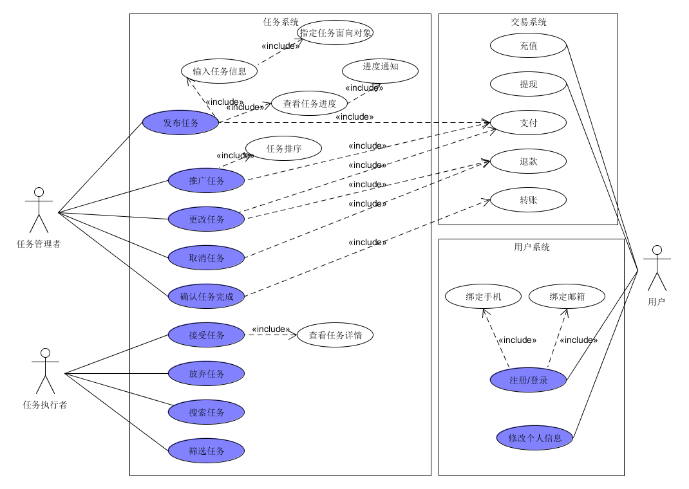

## 二、用例文本与活动图

### 基本用例：

- 管理员：
  - 注册登录：管理员使用web端平台进行注册登录。
  - 审核任务：对于小程序端商家用户发布的任务，管理员可以对其进行审核决定其最终是否显示在任务列表中。
- 商家/大学生用户：
  - 登录：小程序自动获取微信昵称等基本信息后可以进入主界面，但是无法进行其他功能。
  - 身份认证：用户提交自己的相关的身份信息之后完成大学生/商家身份认证。
  - 修改个人信息：用户可以点击个人页面进行昵称、生日等更多个人信息的完善和修改。
  - 发布任务：大学生和商家用户都可以发布任务，进入不同的板块会有不同的发布任务界面，如问卷调查任务发布，代领快递任务发布等，填写任务详情的相关信息即可发布任务，需要向平台支付闲钱币（用于最终支付给完成任务的用户）。
  - 接受任务：之后大学生可以接受任务，在不同板块的任务列表中选择自己感兴趣的任务，点击进入任务详情，点击接单按钮可以开始执行任务，完成任务后会获得一定闲钱币。
  - 充值：用户点击充值，可以使用微信钱包向平台支付一定金额，就可以获得等量闲钱币。
  - 提现：用户点击提现，可以将闲钱币提现到微信钱包中。
  - 更改任务: 对于已发布的任务，在还没有用户接单的情况下可以修改任务相关信息，例如截止日期，任务要求，任务酬劳等。
  - 取消任务：对于已发布的任务，在还没有用户接单的情况下可以取消任务，向平台支付的闲钱币会退回到发布任务者账户中。
  - 确认任务完成：发布任务者验收任务完成情况，若任务完成则点击确认任务完成按钮，平台就会把预先支付的闲钱币转给任务接受者。
  - 放弃任务：对于已经接受但是未完成的任务，用户可以选择放弃，放弃任务无法获得闲钱币。
  - 搜索任务：对于每个任务板块，用户可以输入一些关键词进行搜索，搜索结果是包含该关键词的任务。
  - 筛选任务：对于每个任务板块，用户可以根据时间、地点、酬劳等条件筛选感兴趣的任务。

### 扩展用例：

- 任务历史：每个用户的个人页面有任务历史接口，进入任务历史界面会显示所有该用户发布或接受过的任务。
- 任务进度：发布任务者可以点击任务详情查看任务完成进度，对于已经绑定邮箱的用户，发布的任务被顺利完成时该邮箱会收到邮件通知。
- 指定任务面向对象：任务发布者发布任务时可以设置接受任务者的条件，例如年龄，性别等。

### 选做用例：

- 推广任务：发布任务者向平台额外支付一定的闲钱币，平台会将推广的任务放在任务列表的顶部，多个被推广的任务按照额外支付的闲钱币的多少排序。

### 活动图

- 普通用户：

  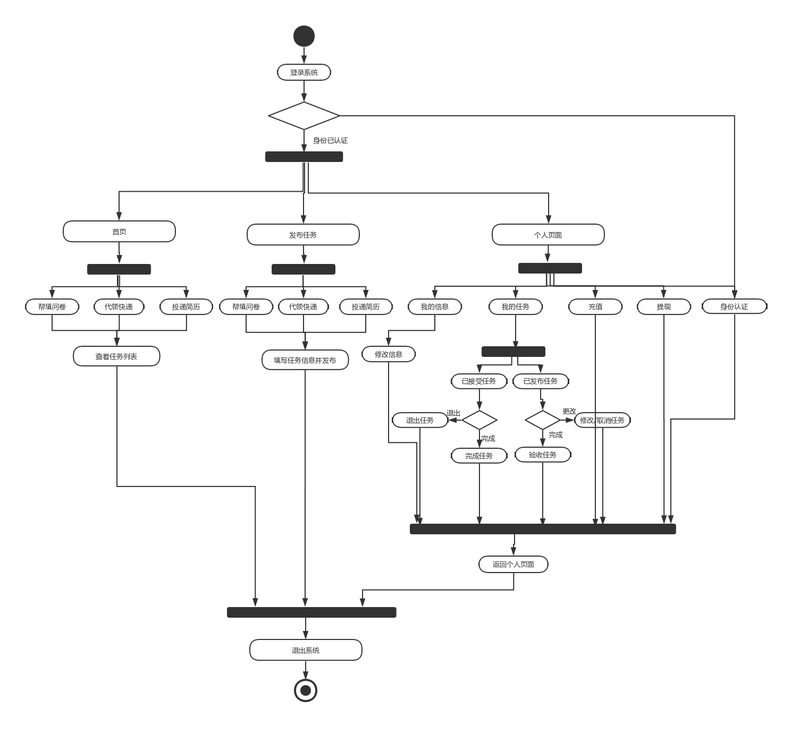

- 管理员：

  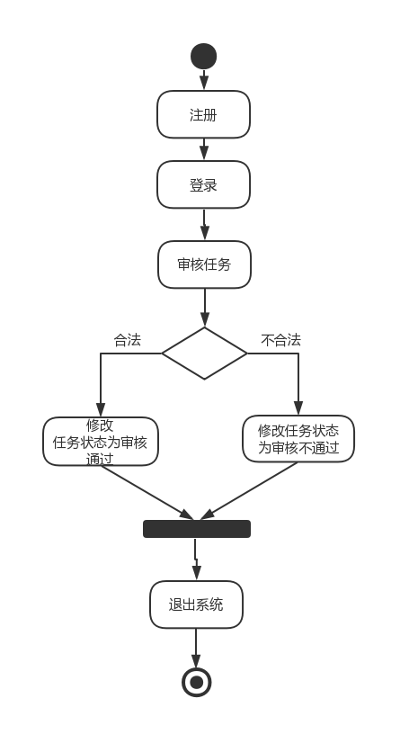

  ## 三、领域模型

  

## 四、状态模型

### 任务状态图

本图是为了直观描述任务从创建到兑付状态，以及放弃任务等异常状态的转移变化过程。

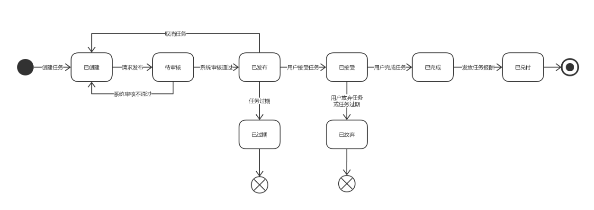

## 五、功能模型

### 登录

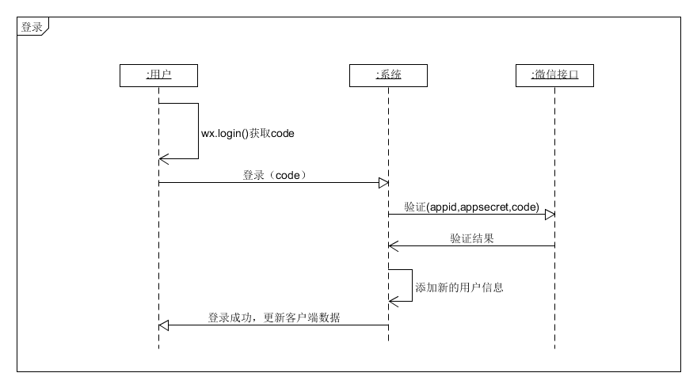

### 身份认证

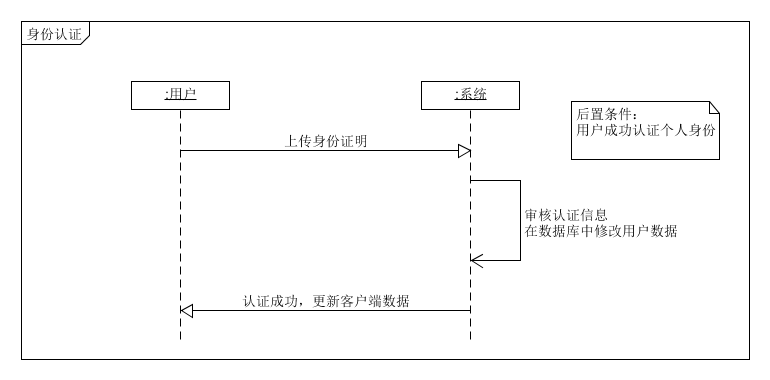

### 修改个人信息

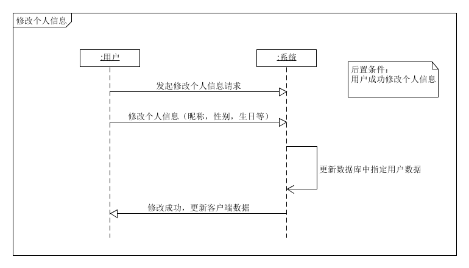

### 充值

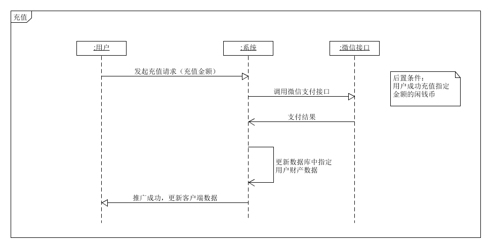

### 提现

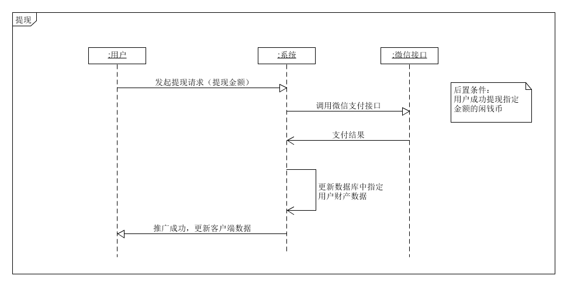

### 发布任务

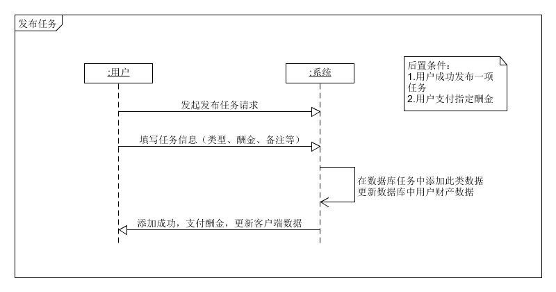

### 取消任务

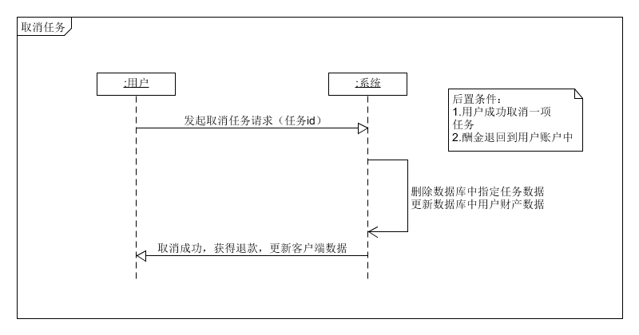

### 接受任务

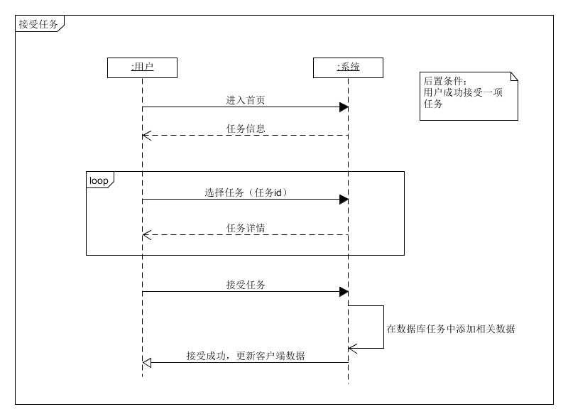

### 退出任务

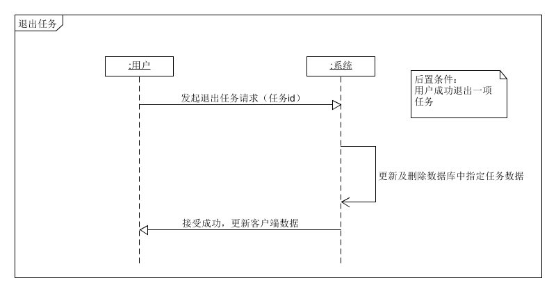

### 完成任务

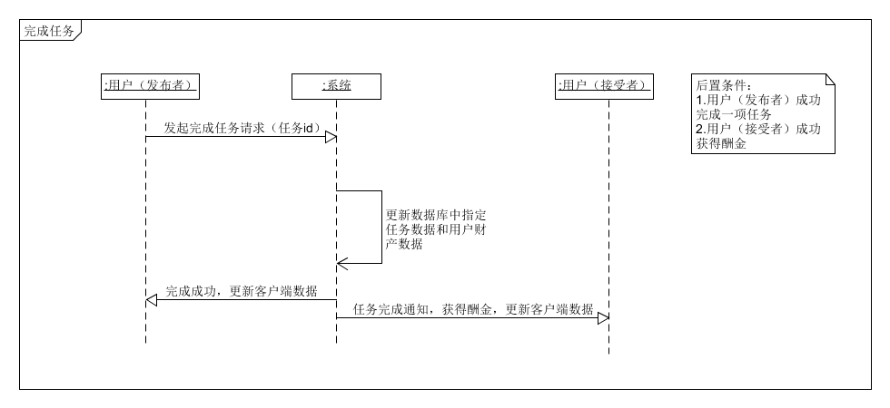

### 推广任务

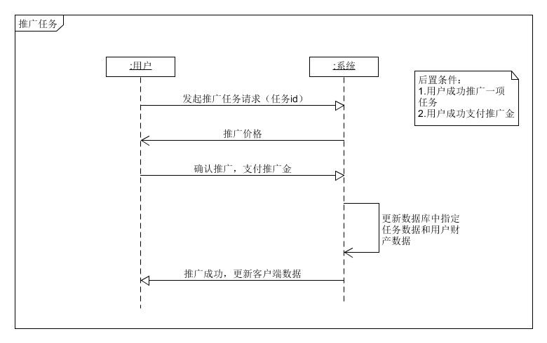

